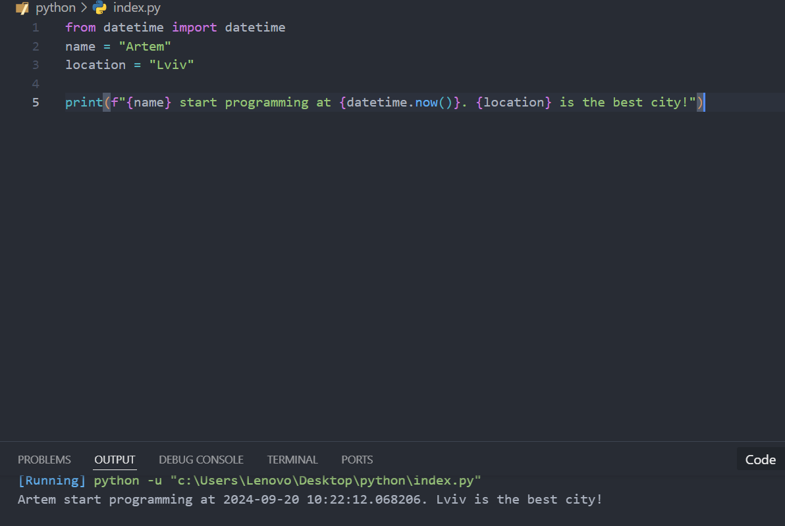

# 2024_kn240
Репозиторій з предмету ООП

Це зміни внесені з локального компютера

А це вже наступні зміни 

Результати виконання завдань: 
    1. Встановили Пайтон на Visual Studio
    1.Створили репозиторій
    * Долаштували локальне середовище  та приступаємо до першої програми
    * Створили Пайтон файл  Вставили код програми та запустили її..
    ..результат виконання програми показано на скріншоті
    * Продовжую роботу та виконувати прогрму тепер у [Пайтон Ноутбуці](/index.ipynb)
    Результат виконання роботи в [Пайтон Ноутбуці](/index.ipynb)
    Результат виконання індивідуального завданння 
    
    
    Звіт до роботи
Тема: згідно теми
Мета роботи: згідно теми
Виконання роботи
Результати виконання завдання 1...N;

якщо графічних файлів багато то краще помістити їх у окрему папку, наприклад у мене це папка pictures. Уважно дивіться коли вставляєте URL - файл має бути представленим як raw. А краще користуйтесь локальними шляхами!

з використанням URL alt text

через локальні шляхи alt text

вставлений код / текстовий або числовий результат / інші результати:

так можна вставляти код, або просто вствляйте посилання на файл з програмою;
def simple_function_example():
    pass
якщо потрібно виділити текст, тоді:
<< Тут можна писати те що хочемо виокремити >>
результати виконання індивідуального завдання (якщо такі є);

Висновок:
у висновку потрібно відповісти на запитання:

❓ Що зроблено в роботі;
    Було скачано пайтон, та всі потрібні до нього бібліотеки
❓ Чи досягнуто мети роботи;
    Так, мета роботи була досягнута
❓ Які нові знання отримано;
    Нові завдання потрібно дивитись відповідно завданню
❓ Чи вдалось відповісти на всі питання задані в ході роботи;
    Так
❓ Чи вдалося виконати всі завдання;
    Так
❓ Чи виникли складності у виконанні завдання;
    Ні
❓ Чи подобається такий формат здачі роботи (Feedback);
    Так, не погано
❓ Побажання для покращення (Suggestions);
    